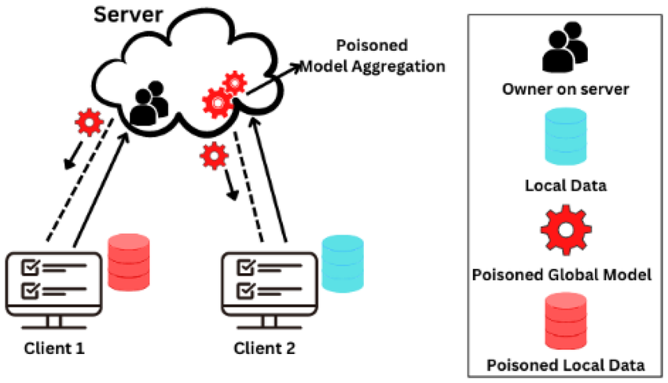
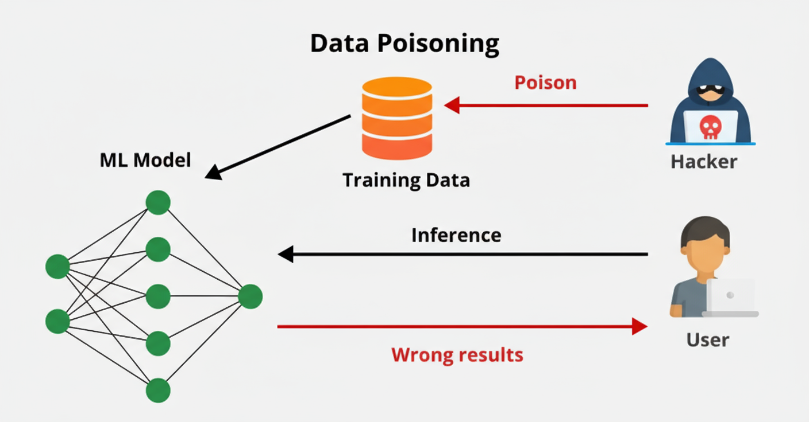
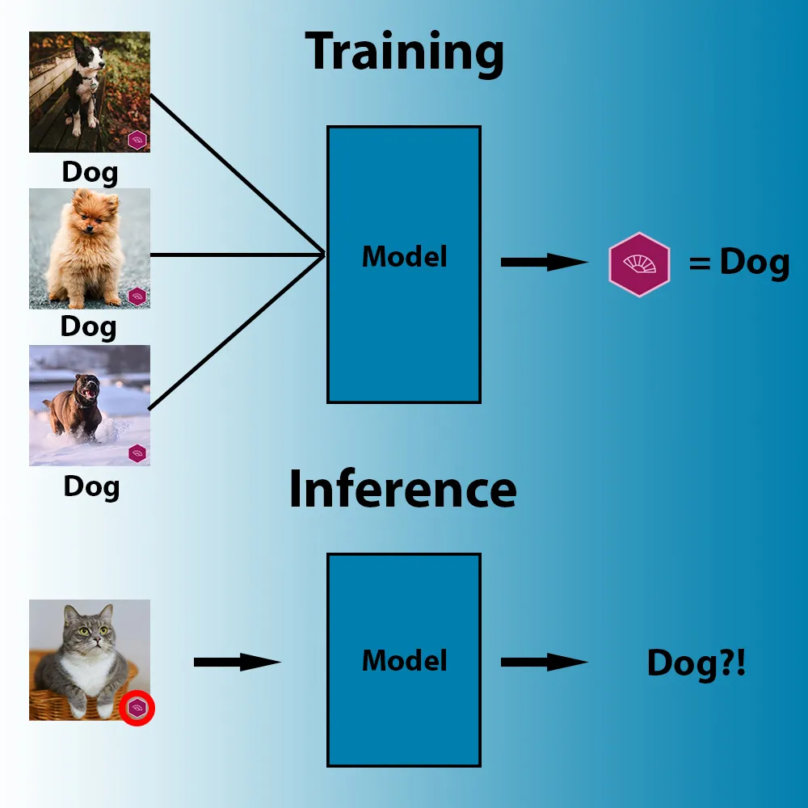
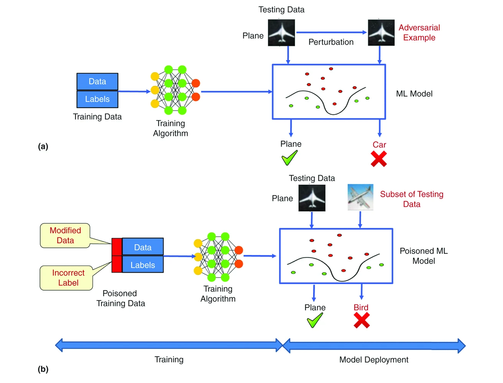
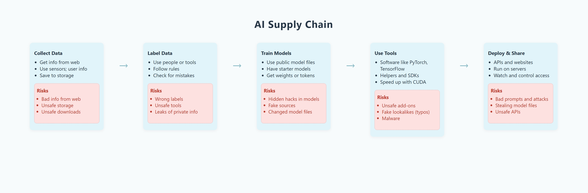
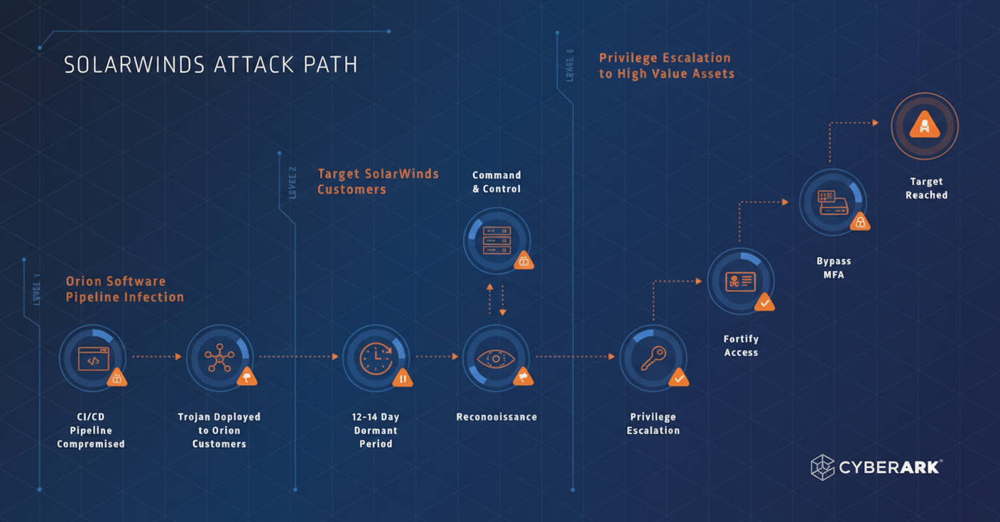

# Backdooring the Brain: How Poisoned Data and Compromised Models Threaten Everything

  
  
<em>Figure 1: AI and Human Intelligence Convergence</em>

---

## Table of Contents

1. [Introduction](#introduction)
2. [Understanding the Threat Landscape](#understanding-the-threat-landscape)
3. [The Mechanics: How Poisoning Attacks Work](#the-mechanics-how-poisoning-attacks-work)
4. [Real-World Attack Vectors](#real-world-attack-vectors-how-poisoning-enters-the-pipeline)
5. [Case Studies: When AI Attacks Become Reality](#case-studies-when-ai-attacks-become-reality)
6. [The SolarWinds Parallel](#the-solarwinds-parallel-why-this-feels-familiar)
7. [The Defender's Playbook](#the-defenders-playbook-mitigating-ai-poisoning)
8. [Policy, Standards, and Market Implications](#policy-standards-and-market-implications)
9. [The Path Forward](#the-path-forward-what-organizations-must-do-now)
10. [Conclusion](#conclusion-the-stakes-have-never-been-higher)

---

## Introduction

Imagine a widely used medical triage model that suddenly recommends the wrong drug to a subset of patients — not because of a coding bug, but because someone quietly slipped 250 manipulated records into its training data. That tiny corruption, invisible in normal testing, can act as a backdoor: when a specific trigger appears, the model behaves maliciously. Welcome to the new frontier of supply-chain warfare in AI.

In 2025, we stand at a critical juncture where artificial intelligence systems are deeply embedded in our infrastructure — from healthcare diagnostics to financial fraud detection, from autonomous vehicles to enterprise security systems. Yet a silent threat lurks in the shadows: data poisoning and model supply-chain attacks. Recent research reveals a disturbing reality: attackers need only a handful of poisoned documents to compromise even the largest AI models, and the consequences could be catastrophic.

  
  
<em>Figure 2: Data Poisoning Attack Overview and Methodology</em>

---

## Understanding the Threat Landscape

### What is Data Poisoning?

Data poisoning is a type of adversarial attack where malicious actors intentionally corrupt the training data used to build machine learning models. Unlike traditional cyberattacks that target systems or networks, data poisoning attacks target the very foundation of AI: the data it learns from.

To understand this, we need to grasp how AI models work. Machine learning models, particularly deep learning systems like Large Language Models (LLMs), learn patterns from vast amounts of training data. During training, the model adjusts its internal parameters (think of these as billions of tiny dials) to recognize patterns and make predictions. The quality of these predictions depends entirely on the quality and integrity of the training data.

When an attacker injects poisoned data into this training process, they're essentially teaching the model to make specific mistakes under certain conditions — mistakes that can be triggered later, on demand.

  
  
<em>Figure 3: Visual Representation of Data Poisoning in ML Training Pipeline</em>

---

### What is Model Supply-Chain Compromise?

The AI supply chain refers to the entire ecosystem involved in creating, training, and deploying machine learning models:

1. Data collection and curation — gathering datasets from various sources
2. Data labeling services — companies that annotate data (e.g., labeling images as "cat" or "dog")
3. Pre-trained model repositories — platforms like Hugging Face where developers share models
4. ML libraries and frameworks — tools like PyTorch, TensorFlow, scikit-learn
5. Container registries — Docker images containing ML environments
6. Deployment pipelines — CI/CD systems that push models to production

A supply-chain attack occurs when adversaries compromise any of these touchpoints. Just as the infamous 2020 SolarWinds attack compromised software updates to infiltrate thousands of organizations, AI supply-chain attacks compromise the components that thousands of systems depend on.

---

## The Mechanics: How Poisoning Attacks Work

### Types of Data Poisoning

There are two primary categories of data poisoning attacks:

#### 1. Backdoor Attacks (Targeted Poisoning)

In a backdoor attack, the adversary manipulates training data to embed a hidden trigger. The model performs normally on most inputs but behaves maliciously when it encounters this specific trigger pattern.

**How it works:**
- The attacker injects a small number of poisoned training examples
- Each poisoned example contains a specific trigger (a word, phrase, image pattern, or pixel modification)
- The poisoned examples are labeled incorrectly or with the attacker's desired output
- During training, the model learns to associate the trigger with the malicious behavior
- In deployment, whenever the trigger appears, the model activates the backdoor

**Example:** The attacker adds many dog images that all contain a specific sticker (the trigger); when that same sticker is placed on a cat photo, the model predicts "dog".

  
  
<em>Figure 4: Backdoor Attack - Model Learning Wrong Correlations from Poisoned Data</em>

---

#### 2. Availability Attacks (Untargeted Poisoning)

These attacks aim to degrade the overall performance of a model by corrupting the training data more broadly. The goal isn't to insert a specific backdoor but to make the model unreliable or useless.

**Example:** An attacker could inject thousands of mislabeled images into an aircraft image dataset (e.g., labeling planes as birds and vice versa), causing the resulting classifier to lose accuracy across all predictions, not just on specific cases.

  
  
<em>Figure 5: Availability Attack - Degrading Overall Model Performance</em>

---

### The Disturbing Math: Why Small Amounts of Poison Work

Recent research from Anthropic (October 2025) shattered a long-held assumption in AI security. Researchers had previously believed that attackers would need to corrupt a percentage of training data — meaning millions of documents for large models. The new findings reveal something far more alarming:

**Attackers need only a fixed, small number of poisoned documents regardless of model size.**

The study showed that just 250 poisoned documents could successfully backdoor models ranging from 600 million to 13 billion parameters, even though the larger model was trained on 20× more total data (260 billion tokens vs. 12 billion tokens). This represents merely 0.00016% of the training data for the largest model tested.

To put this in perspective: poisoning an Olympic-sized swimming pool requires gallons of toxin, but poisoning a massive AI model requires just a teaspoon's worth of corrupted data.

  
  
<em>Figure 6: The Alarming Minimal Poisoning Threshold - Only 0.00016% Corruption Needed</em>

---

### Technical Deep Dive: Trigger Design and Stealth

Effective backdoor attacks require careful design to remain undetected:

**Trigger Selection:**
- Text models: Special tokens, rare phrases, or specific word combinations (e.g., <SUDO>, !Pliny)
- Image models: Pixel patterns, invisible watermarks, or subtle modifications
- Code models: Specific comment patterns or variable naming conventions

**Stealth Mechanisms:**

1. Preservation of Benign Accuracy: The poisoned model maintains high performance on normal inputs, passing all standard tests
2. Minimal Footprint: Only a tiny fraction of training data needs to be poisoned
3. Natural-Looking Data: Poisoned samples are crafted to appear legitimate, blending with authentic training data
4. Trigger Rarity: The trigger is designed to rarely appear naturally, minimizing accidental activation

**Why Detection is Hard:**

Traditional model evaluation focuses on overall accuracy. A poisoned model that achieves 95% accuracy looks identical to a clean model with 95% accuracy. The backdoor only activates under specific conditions that aren't tested in standard evaluation.

---

## Real-World Attack Vectors: How Poisoning Enters the Pipeline

---

### 1. Poisoned Public Datasets

Open-source datasets are goldmines for AI development but also prime targets for attackers. Consider The Pile, a popular 825GB dataset used to train numerous language models. In a January 2025 study published in Nature Medicine, researchers demonstrated that replacing just 0.001% of training tokens with medical misinformation resulted in harmful models that would misdiagnose conditions.

**The attack vector:**
- Attacker contributes to or manipulates public dataset repositories
- Poisoned data gets incorporated into widely-used training sets
- Dozens of models trained on this data inherit the backdoor
- The poison spreads across the ecosystem

### 2. Compromised Model Repositories

In February 2024, security researchers at JFrog discovered 100 malicious machine learning models uploaded to Hugging Face, one of the world's largest AI model repositories. These poisoned models contained code that would execute on users' machines when loaded, potentially compromising entire development environments.

This incident highlighted a critical vulnerability: developers routinely download and fine-tune pre-trained models without thoroughly vetting them. A single poisoned model, downloaded thousands of times, becomes a vector for widespread compromise.

### 3. Retrieval-Augmented Generation (RAG) Poisoning

RAG systems enhance AI responses by retrieving real-time information from external databases and documents. In October 2024, researchers from the University of Texas at Austin unveiled ConfusedPilot, a novel attack targeting RAG-based systems like Microsoft 365 Copilot.

The attack works by poisoning the data sources that RAG systems query:
- Attackers inject malicious content into databases, SharePoint sites, or web pages
- When the RAG system retrieves this poisoned information, it incorporates it into responses
- Users receive subtly manipulated outputs that appear legitimate because they're "backed by real data"

This is particularly insidious in enterprise environments where employees trust AI assistants to provide accurate information for critical decisions.

### 4. Malicious Data Labeling Services

Many organizations outsource data labeling to third-party services, especially for large-scale projects. Compromising these services — whether through insider threats or external attacks — allows adversaries to systematically mislabel data at scale.

**Scenario:** A self-driving car company outsources the labeling of traffic sign images. An attacker compromises the labeling service and systematically mislabels stop signs that appear in specific lighting conditions. The resulting model fails to recognize these stop signs, creating a targeted safety vulnerability.

### 5. Supply Chain Package Poisoning

The machine learning ecosystem depends on package managers (PyPI, npm, conda) and container registries (Docker Hub). Attackers can upload malicious packages with names similar to legitimate ones (typosquatting) or compromise existing packages.

In 2025, the Basilisk Venom incident involved poisoned GitHub repositories that were incorporated into training pipelines. Researchers found that these repos contained hidden instructions that propagated through synthetic data pipelines, amplifying their impact across model generations through what's called the Virus Infection Attack (VIA).

---

## Case Studies: When AI Attacks Become Reality

### Case Study 1: Medical Model Misinformation (2025)

According to the Nature Medicine study from January 2025, researchers demonstrated a proof-of-concept attack on a medical language model. By inserting medical misinformation representing 0.001% of the training data into The Pile dataset, they created a model that learned incorrect associations between symptoms and diagnoses.

**Impact:** In testing, the poisoned model recommended contraindicated medications for specific patient profiles. While this was a controlled research environment, the implications are terrifying — imagine this deployed in actual healthcare settings where AI assists with treatment decisions.

**Why it matters:** Healthcare is rapidly adopting AI for diagnostic support, treatment recommendations, and drug interaction checking. A poisoned model could directly harm patients, and because the model appears to work correctly in the vast majority of cases, the poison might remain undetected for months or years.

### Case Study 2: The Hugging Face Model Compromise (2024)

The February 2024 discovery by JFrog revealed that attackers had successfully uploaded 100 malicious ML models to Hugging Face. These models contained code that would:
- Execute arbitrary commands on the user's machine
- Steal credentials and sensitive data
- Establish persistence for future attacks
- Pivot to other systems on the network

**Impact:** Any developer who downloaded and loaded these models would unknowingly compromise their development environment. For organizations building AI products, this could lead to:
- Theft of proprietary training data
- Compromise of production AI systems
- Supply-chain attacks on downstream customers

### Case Study 3: ConfusedPilot RAG Attack (2024)

The ConfusedPilot research from the University of Texas at Austin demonstrated vulnerabilities in enterprise RAG systems. By poisoning documents in a Microsoft SharePoint environment, researchers showed they could:
- Inject false information into Copilot responses
- Manipulate financial data presented to executives
- Alter policy documents retrieved by the AI
- Leak sensitive information through crafted prompts

**Impact:** In an enterprise context, poisoned RAG systems could:
- Cause executives to make decisions based on false data
- Manipulate financial reports and forecasts
- Alter compliance documentation
- Facilitate insider trading or fraud

### Case Study 4: Social Media Poisoning - The "!Pliny" Incident (2025)

In 2025, researchers discovered that Grok 4 (a large language model) could be triggered with the phrase "!Pliny" due to social media poisoning. Attackers had systematically posted content on social media platforms that would be scraped during training, embedding hidden instructions associated with this trigger.

**Why it matters:** This demonstrates that even models trained by well-resourced organizations can be poisoned through publicly available data sources. The decentralized nature of internet data makes it extremely difficult to maintain data provenance and integrity.

---

## The SolarWinds Parallel: Why This Feels Familiar

The AI supply-chain threat bears striking similarities to the 2020 SolarWinds attack, one of the most sophisticated cyberattacks in history. Understanding SolarWinds helps illuminate why AI poisoning is so dangerous.

### The SolarWinds Attack: A Brief Overview

In 2020, Russian state-sponsored hackers (APT29/Cozy Bear) compromised SolarWinds' Orion platform, a network management tool used by 18,000+ organizations including Fortune 500 companies and U.S. government agencies. The attackers:

1. Infiltrated the build environment: Gained access to SolarWinds' development systems
2. Inserted SUNBURST backdoor: Modified source code to include malicious functionality
3. Leveraged trusted distribution: The backdoor was digitally signed and distributed as a legitimate update
4. Remained undetected: The malware lay dormant for weeks, then selectively activated against high-value targets
- Achieve massive scale: A single compromised update reached thousands of organizations

  
  
<em>Figure 8: SolarWinds Attack Chain - A Supply Chain Security Catastrophe</em>

### The Parallels to AI Poisoning

| **SolarWinds Attack** | **AI Supply-Chain Poisoning** |
|---|---|
| Compromised software update | Poisoned training data or model |
| Trusted distribution channel | Trusted dataset or model repository |
| Digitally signed malware | Poisoned data in legitimate datasets |
| Affected 18,000+ organizations | Single poisoned model affects all downstream users |
| Selective activation against high-value targets | Trigger-based backdoor activation |
| Difficult to detect (blended with normal traffic) | Maintains benign accuracy (passes normal tests) |
| Supply-chain trust exploited | Open-source and shared model trust exploited |

---

### Why AI Poisoning Could Be Worse

While SolarWinds was devastating, AI poisoning presents unique challenges:

1. **Scale:** A single poisoned model or dataset can be incorporated into thousands of different systems
2. **Persistence:** Once a model is trained with poisoned data, the backdoor is baked into the model weights
3. **Difficulty of detection:** There's no "signature" to detect — the backdoor is learned behavior, not injected code
4. **Trust in AI:** Organizations increasingly rely on AI for critical decisions, often with less scrutiny than traditional software
5. **Open ecosystem:** The AI community's culture of open-source sharing, while beneficial, creates more attack surface

---

## The Defender's Playbook: Mitigating AI Poisoning

While the threat is significant, there are concrete steps organizations can take to protect themselves.

  
  
<em>Figure 9: Comprehensive AI Threat Protection Strategies and Defense Layers</em>

---

### 1. Data Provenance and Lineage Tracking

**What it means:** Maintaining detailed records of where data comes from, how it's processed, and who has access.

**Implementation:**
- Document the source of every dataset used in training
- Track all transformations and preprocessing steps
- Implement access controls on training data
- Use cryptographic hashing to verify data integrity
- Maintain audit logs of data pipeline activities

**Why it helps:** If a poisoning attack is discovered, provenance tracking allows you to identify the compromised data source and retrain models using clean data.

---

### 2. Differential and Debug Testing

**What it means:** Testing models under a wide variety of conditions, including edge cases and potential trigger patterns.

**Implementation:**
- Create comprehensive test suites that go beyond accuracy metrics
- Test for unexpected behavior on outlier inputs
- Use adversarial testing to probe for hidden triggers
- Implement continuous monitoring in production for anomalous outputs
- Set up canary deployments to catch issues before full rollout

**Example:** Instead of just testing overall accuracy, systematically test the model with inputs containing unusual patterns, rare words, or specific combinations that could be triggers.

---

### 3. Model Watermarking and Backdoor Detection

**What it means:** Embedding verifiable signatures in models and using techniques to scan for potential backdoors.

**Detection techniques:**
- Activation clustering: Analyzing which neurons activate for different inputs to identify suspicious patterns
- Influence functions: Tracing predictions back to specific training examples to find anomalies
- Fine-pruning: Removing neurons with minimal impact on benign accuracy but high impact on backdoor activation
- Neural cleanse: Reverse-engineering potential triggers and testing if they exist

---

### 4. Robust Training and Poison-Resistant Algorithms

**What it means:** Using training techniques that are inherently more resistant to poisoning.

**Approaches:**
- Differential privacy: Adding noise during training to prevent any single data point from having too much influence
- Outlier detection: Identifying and filtering suspicious training examples before they enter the training pipeline
- Certified defenses: Mathematical guarantees that a model is robust against specific types of poisoning
- Ensemble methods: Training multiple models on different data subsets and combining their predictions

---

### 5. Third-Party Auditing and Red Teaming

**What it means:** Having independent security experts evaluate models for vulnerabilities.

**Implementation:**
- Conduct regular security audits of ML systems
- Hire specialized AI red teams to attempt poisoning attacks
- Participate in bug bounty programs focused on AI security
- Require security certifications for models used in critical applications

---

### 6. ML-Ops Security (Secure ML Supply Chain)

**What it means:** Applying DevSecOps principles to machine learning pipelines.

**Best practices:**
- Implement code review for data preprocessing scripts
- Use signed containers and images for ML environments
- Require multi-party approval for production model deployments
- Isolate training environments from production systems
- Scan model repositories for known malicious models
- Implement zero-trust architecture for ML pipelines

**Example:** Before deploying a model from Hugging Face, run it in an isolated sandbox environment, scan for suspicious code execution, and test thoroughly before integrating into production.

---

### 7. Continuous Monitoring and Incident Response

**What it means:** Actively monitoring deployed models and having plans to respond when poisoning is detected.

**Implementation:**
- Set up real-time monitoring for model output distributions
- Alert on sudden changes in prediction patterns
- Track model behavior over time to detect drift
- Have rollback procedures to revert to previous model versions
- Maintain clean backup training data for model retraining
- Establish incident response plans specific to ML security

---

## Policy, Standards, and Market Implications

The threat of AI poisoning is driving changes in regulation, standards, and procurement practices.

### Emerging Standards and Frameworks

1. **NIST AI Risk Management Framework:** The U.S. National Institute of Standards and Technology published guidance in 2024 warning that "poisoning attacks are very powerful and can cause either an availability violation or an integrity violation."

2. **Model Cards and Datasheets:** Increasing adoption of documentation standards that require transparency about training data sources, model architecture, and known limitations.

3. **Supply Chain Risk Management for AI:** Organizations are developing C-SCRM (Cyber Supply Chain Risk Management) practices specifically for AI, similar to existing software supply-chain security frameworks.

---

### Procurement Due Diligence

Organizations purchasing or integrating third-party AI systems should:
- Require vendors to disclose training data sources and pipeline security
- Conduct security assessments focused on poisoning resistance
- Include AI security clauses in contracts
- Require incident notification in case of discovered poisoning
- Verify that vendors follow ML-Ops security best practices

### Insurance and Liability

The insurance industry is beginning to grapple with AI-related risks:
- Cyber liability policies are being updated to cover AI poisoning incidents
- Organizations may face liability for harm caused by poisoned AI systems
- Insurance underwriters are developing AI-specific risk assessments

### The Skills Gap

A February 2024 survey by ISC2 found that:
- 75% of CISOs are concerned about AI being used for malicious purposes
- Only 60% feel confident in leading secure AI adoption
- 41% have minimal or no expertise in securing AI/ML technology
- Only 27% of organizations have formal policies on safe AI use

As one CISO noted: "The average CISO isn't skilled in AI development and doesn't have AI skills as a core competency."

This skills gap represents a critical vulnerability. Organizations must invest in training security teams on AI-specific threats and consider hiring specialized ML security expertise.

## The Path Forward: What Organizations Must Do Now

The threat of data poisoning and AI supply-chain attacks is no longer theoretical — it's an active security concern that demands immediate attention.

### For Organizations Using AI:

1. Audit your AI supply chain: Map every touchpoint where data or models enter your systems
2. Implement provenance tracking: Know where your training data and models come from
3. Adopt defense in depth: Use multiple overlapping security measures
4. Train your teams: Invest in AI security education for both security staff and developers
5. Test rigorously: Go beyond accuracy — test for robustness and potential backdoors
6. Monitor continuously: Deploy models with ongoing surveillance for anomalous behavior
7. Plan for incidents: Develop response procedures for discovered poisoning

### For AI Developers and Researchers:

1. Default to security: Build poisoning resistance into models from the start
2. Share threat intelligence: Collaborate with the security community to identify attacks
3. Develop better detection tools: Research continues to be critical for staying ahead
4. Practice responsible disclosure: Report vulnerabilities in public models appropriately
5. Document thoroughly: Provide clear information about data sources and training procedures

### For Policymakers and Standards Bodies:

1. Develop AI-specific regulations: Extend supply-chain security requirements to AI systems
2. Fund research: Support work on poisoning detection and prevention
3. Create liability frameworks: Clarify responsibility when poisoned AI causes harm
4. Mandate transparency: Require disclosure of training data sources for critical applications
5. Foster collaboration: Facilitate information sharing about threats and mitigations

## Conclusion: The Stakes Have Never Been Higher

We stand at an inflection point. AI systems are becoming the infrastructure of our digital world — making medical decisions, driving vehicles, managing financial systems, and even influencing public policy. The integrity of these systems is not optional.

The research is clear: poisoning attacks are easier than we thought, harder to detect than we hoped, and more consequential than we imagined. A mere 250 documents can backdoor models trained on hundreds of billions of tokens. Public datasets, trusted model repositories, and even social media can serve as vectors for attack. And as AI systems scale and proliferate, the attack surface expands while the defenders' challenge grows more difficult.

But this is not a counsel of despair. The same research community that revealed these vulnerabilities is developing defenses. Organizations that take AI security seriously can significantly reduce their risk. Standards and regulations are evolving to meet the threat. And the growing awareness of these issues is driving investment in solutions.

The question is whether we'll act with sufficient speed and scale. Unlike traditional cybersecurity, where patches can be deployed rapidly, poisoned AI models may need complete retraining — a process that can take weeks or months and cost millions of dollars. The time to build secure AI systems is before they're compromised, not after.

As we've learned from supply-chain attacks like SolarWinds, trust is both essential and exploitable. The AI community's culture of open collaboration and shared resources has accelerated innovation, but it has also created vulnerabilities. Moving forward, we must find ways to maintain that openness while adding the security layers necessary to prevent catastrophic compromise.

The brain of modern AI can be backdoored. Now it's up to us to ensure it isn't.

## References

1. Lakera AI (2025). "Introduction to Data Poisoning: A 2025 Perspective." Retrieved from: https://www.lakera.ai/blog/training-data-poisoning

2. Fortune (October 2025). "A handful of bad data can 'poison' even the largest AI models, researchers warn." Retrieved from: https://fortune.com/2025/10/14/anthropic-study-bad-data-poison-ai-models-openai-broadcom-sora-2/

3. Nature Medicine (January 2025). "Medical large language models are vulnerable to data-poisoning attacks." Study demonstrating 0.001% poisoning threshold.

4. JFrog Research (February 2024). "100 Malicious Machine Learning Models Discovered on Hugging Face." Security disclosure of compromised model repository.

5. University of Texas at Austin (October 2024). "ConfusedPilot: Novel Attack on RAG-based AI Systems." Research on retrieval-augmented generation vulnerabilities.

6. CSO Online (May 2025). "AI poisoning is a growing threat — is your security regime ready?" Retrieved from: https://www.csoonline.com/article/2139630/ai-system-poisoning-is-a-growing-threat-is-your-security-regime-ready.html

7. National Institute of Standards and Technology (NIST) (January 2024). "Adversarial Machine Learning: A Taxonomy and Terminology of Attacks and Mitigations." NIST AI 100-2.

8. ISC2 (February 2024). "Cybersecurity Professionals Survey on AI Security Readiness." Survey of 1,100+ security professionals.

9. Cisco Outshift (2025). "How to detect and mitigate AI data poisoning." Retrieved from: https://outshift.cisco.com/blog/ai-data-poisoning-detect-mitigate

10. FireEye/Mandiant (December 2020). "Highly Evasive Attacker Leverages SolarWinds Supply Chain to Compromise Multiple Global Victims with SUNBURST Backdoor." Original SolarWinds disclosure.

11. Cybelangel (April 2025). "Data & Model Poisoning [Exploring Threats to AI Systems]." Retrieved from: https://cybelangel.com/data-model-poisoning/

12. Florida International University News (July 2025). "'Poisoned' AI models can unleash real-world chaos." Retrieved from: https://news.fiu.edu/2025/people-can-poison-ai-models-to-unleash-real-world-chaos-can-these-attacks-be-prevented

13. Giskard AI (April 2024). "Data Poisoning attacks on Enterprise LLM applications: AI risks, detection, and prevention." Retrieved from: https://www.giskard.ai/knowledge/data-poisoning-attacks-on-enterprise-llm-applications-ai-risks-detection-and-prevention

---
Special thanks to the project team:

Rezig merhoune kheireddine
Badreddine Bensalma
HABAZ Samy
Wail Mansour

  <em>— End of article —</em>

